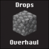

[![Issues][issues-shield]][issues-url]

<br />
<div align="center">
  <a href="https://github.com/FrankTCA/DropsOverhaul">
    
  </a>

<h3 align="center">Drops Overhaul</h3>

  <p align="center">
    A concept lag plugin that prevents drops before they happen
    <br />
    <a href="https://www.spigotmc.org/resources/dropsoverhaul.91000/"><strong>Download plugin »</strong></a>
    <br />
    <br />
    <a href="https://infotoast.org/">See our website</a>
    ·
    <a href="https://github.com/FrankTCA/DropsOverhaul/issues">Report Bugs</a>
  </p>
</div>

DropsOverhaul is a modern and simple lag plugin that operates very simply.

Rather than having the drops be on the ground, DropsOverhaul simply *puts them in your inventory*

To prevent bugs, DropsOverhaul only handles junk blocks, and lets vanilla handle the rest.

## List of Junk Blocks
- Dirt
- Stone
- Sand
- Sandstone
- Diorite
- Granite
- Andesite
- Gravel
- Netherrack
- Blackstone
- Basalt
- Grass
- Tuff
- Calcite
- (Cobbled) Deepslate
- Smooth Basalt


## How to Use
1. Download a jar from <a href="https://www.spigotmc.org/resources/dropsoverhaul.91000/">SpigotMC</a>
2. Place in `plugins` folder.
3. Restart server.

## Installation/Building
If you wish to build from source, just clone this repository, and then
```gradlew jar``` on Windows, or
```./gradlew jar``` on Mac, Linux, or UNIX

[issues-shield]: https://img.shields.io/github/issues/FrankTCA/LoraxCustomTrees.svg?style=for-the-badge
[issues-url]: https://github.com/FrankTCA/LoraxCustomTrees/issues
[license-shield]: https://img.shields.io/github/license/FrankTCA/LoraxCustomTrees.svg?style=for-the-badge
[license-url]: https://github.com/PG85/OpenTerrainGenerator/blob/master/LICENSE.md
